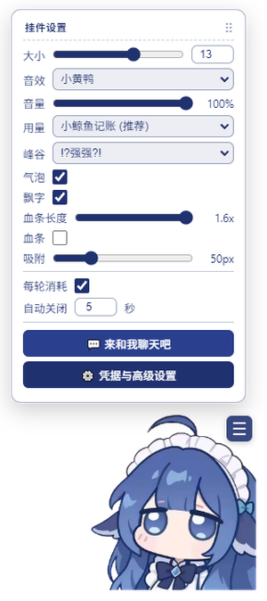
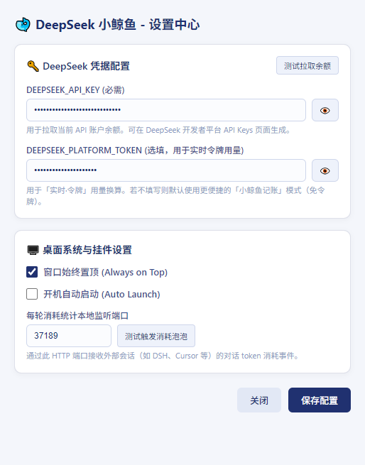

<div align="center">

# 🐋 DeepSeek 余额小鲸鱼桌面宠物
### DeepSeek Whale Girl Desk Pet

常驻桌面的轻量无边框挂件 · API 余额实时监控 · 峰谷阶梯记账 · 对话消耗结算泡泡 · 像素级鼠标穿透

[](https://github.com/nayru77mi/deepseek-Whale-Girl-Desk-Pet/releases)
[](LICENSE)
[](https://electronjs.org/)
[](https://github.com/nayru77mi/deepseek-Whale-Girl-Desk-Pet)
[](https://platform.deepseek.com/)

<br/>


</div>

---

## 📸 动态展示与使用图 (Showcase)

<div align="center">
  <table>
    <tr>
      <td align="center" width="25%" valign="top">
        <br/>
        <b>🧸 摸头解压交互</b><br/>
        <sub>按压形变、音效与萌系台词</sub>
      </td>
      <td align="center" width="25%" valign="top">
        <br/>
        <b>💰 余额实时监控</b><br/>
        <sub>平滑数字滚动与峰谷记账</sub>
      </td>
      <td align="center" width="25%" valign="top">
        <br/>
        <b>💬 对话结算泡泡</b><br/>
        <sub>外部 AI 对话实时推送消耗</sub>
      </td>
      <td align="center" width="25%" valign="top">
        <br/>
        <b>⚙️ 自由汉堡菜单</b><br/>
        <sub>缩放/音效/吸附随心调</sub>
      </td>
    </tr>
  </table>
</div>

---

## ✨ 核心特性 (Features)

| 功能模块 | 特性说明 |
| :--- | :--- |
| 🎯 **透明常驻 & 像素穿透** | 基于 Alpha 掩码预计算的零延迟穿透技术。透明区域完全不遮挡桌面图标与操作，仅悬停在鲸鱼实体、气泡与菜单时响应交互。 |
| 💰 **API 余额变动监控** | 60 秒静默轮询 + 点击即时刷新。余额变动带平滑数字滚动动画，遇网络抖动自动沿用本地缓存。 |
| 📊 **今日已用统计（双模式）** | **小鲸鱼记账（推荐）**：无需网页 Token，根据余额差额本地自动累计，跨天自动归档。<br/>**实时·令牌**：支持填入平台 Token 调取官方接口，按峰谷时段单价（9-12点、14-18点 / 闲时）精确换算。 |
| 💬 **每轮对话结算泡泡** | 内置本地轻量 HTTP 监听（默认端口 `37189`），外部工具（Cursor、AI 客户端、本地脚本）完成对话后即可推送 usage，桌宠即刻弹出消耗结算气泡。 |
| 🖱️ **60fps 吸附与左侧镜像** | 靠近屏幕四周与角落自动吸附（支持 0~200px 自由调节或关闭自由停靠），靠左吸附时整体水平镜像翻转并自适应文字朝向。 |
| ⚙️ **汉堡菜单与系统托盘** | **汉堡菜单**：缩放（0.6x~2.5x）、音效、音量、吸附距离一键调节；面板支持自由拖拽且关闭后自动复位；底部提供「💬 来和我聊天吧」秒开官方网页端。<br/>**系统托盘**：一键「重置位置到右下角」、一键刷新余额、窗口置顶切换、独立设置中心。 |

---

## 🚀 快速启动与安装

### 方式 A：直接下载（推荐普通用户）

前往 **[GitHub Releases 发布页](https://github.com/nayru77mi/deepseek-Whale-Girl-Desk-Pet/releases)** 下载最新版预编译文件：

| 版本类型 | 文件名示例 | 特点说明 |
| :--- | :--- | :--- |
| **标准安装包（推荐）** | `DeepSeek余额小鲸鱼 Setup 1.1.0.exe` | 运行安装向导，自动生成带高清图标的桌面与开始菜单快捷方式，支持完整卸载。 |
| **绿色便携版** | `DeepSeek余额小鲸鱼 1.1.0.exe` | **无需安装**，直接双击运行，适合快速体验或随身 U 盘携带。 |

<br/>

<div align="center">
  <br/>
  <sub>独立凭据与高级设置中心（支持即时连通性测试）</sub>
</div>

> **🔑 配置密钥**：启动桌宠后，点击汉堡菜单底部 **「⚙️ 凭据与高级设置」**（或右键托盘图标），填入你的 `DEEPSEEK_API_KEY`（形如 `sk-...`），点击保存即可开始监控。

---

### 方式 B：从源码运行与构建（开发者）

```powershell
# 1. 克隆代码仓库并安装依赖 (建议 Node.js >= 18)
git clone https://github.com/nayru77mi/deepseek-Whale-Girl-Desk-Pet.git
cd deepseek-Whale-Girl-Desk-Pet
pnpm install

# 2. 启动开发环境
pnpm start

# 3. 打包生成 Windows 安装包与便携版
pnpm run build:win
```

---

## 📡 对接外部对话消耗 (Turn Cost API)

桌宠在本地启动了 HTTP 监听服务（默认 `http://127.0.0.1:37189`）。当外部应用或脚本完成一轮对话时，只需发送一个 POST 请求即可触发结算气泡：

```bash
# 方式 1：直接发送消耗金额（元）
curl -X POST http://127.0.0.1:37189/api/turn-event \
  -H "Content-Type: application/json" \
  -d '{"amount": 0.15, "turn": 1, "end": true}'

# 方式 2：发送标准 usage 结构（自动按当前峰谷阶梯单价折算）
curl -X POST http://127.0.0.1:37189/api/turn-event \
  -H "Content-Type: application/json" \
  -d '{
    "model": "deepseek-chat",
    "turn": 1,
    "usage": { "inputTokens": 1500, "outputTokens": 800 },
    "end": true
  }'
```

---

## 📁 目录结构速览

```text
src/
├── main/                 # Electron 主进程 (窗口生命周期、系统托盘、余额轮询、峰谷计算引擎、HTTP 监听)
├── preload/              # 安全隔离 IPC 通信桥梁
└── renderer/             # 挂件前端 (像素级穿透检测、Q弹音频池、拖拽吸附、设置面板)
assets/                   # 应用图标、小鲸鱼精灵图、摸头动图、使用预览图与音效文件
```

---

## 📄 关联文档与开源协议

- 📘 **技术细节与深度优化**：详见 [Bug 修复与性能优化全量日志 (BUGFIX_LOG.md)](BUGFIX_LOG.md)
- 📜 **开源许可**：本项目遵循 [MIT License](LICENSE)。
