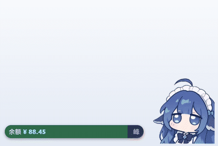

<div align="center">

# 🐋 DeepSeek 余额小鲸鱼桌面宠物
### DeepSeek Whale Girl Desk Pet

**把 API 余额变成一只会掉血的小鲸鱼** —— 常驻桌面 · 余额实时监控 · 扣费即掉血 · 像素级穿透

[](https://github.com/nayru77mi/deepseek-DesktopPet-Shimeji/releases)
[](LICENSE)
[](https://electronjs.org/)
[](https://github.com/nayru77mi/deepseek-DesktopPet-Shimeji)
[](https://platform.deepseek.com/)

<br/>


</div>

---

## ✨ 特性 (Features)

- 💥 **扣费即掉血** —— 伤害飘字三级配色（普通 / 重击 / 暴击），**缓存未命中自动判暴击**；配合鲸鱼受击抖动、`COMBO xN` 连击与打击音效，Token 消耗从数字变成打击感。
- 🩸 **常驻血条** —— 余额 / 今日已用 直接换成血量，越低越红还会呼吸闪烁，峰谷徽章红绿切换；血条 **0.6x~1.6x 长度可调、按住左右拖动微调、一键显隐**，调整全程零窗口闪烁，绝不压住小鲸鱼、绝不拖出屏幕。
- 🧪 **测试版面板** —— 自定义余额 + `💥 普通扣费` / `⚡ 暴击扣费` 一键演练分级动效；`--test` 启动即进测试模式，**不污染**日常配置。
- 💬 **每轮对话结算** —— 本地 HTTP 监听（默认 `37189`），Cursor / AI 客户端 / 脚本推一笔 usage，桌宠立刻弹出结算泡泡。
- 💰 **余额实时监控** —— 60 秒静默轮询 + 点击即刷，数字平滑滚动，断网自动沿用本地缓存。
- 📊 **双模式记账** —— 「小鲸鱼记账」按余额差额本地累计；「实时·令牌」用平台 Token 按峰谷时段单价精确换算。
- 🖱️ **像素级穿透** —— 基于 Alpha 掩码的零延迟穿透，透明区域完全不挡桌面图标，仅悬停鲸鱼 / 气泡 / 菜单时接管鼠标。
- 🖼️ **边缘吸附与镜像** —— 贴屏自动吸附（0~200px 可调或关闭自由停靠），靠左吸附整体镜像翻转、文字自适应朝向。
- ⚙️ **菜单与托盘** —— 缩放 0.6x~2.5x、音效音量、吸附距离随手调；面板可自由拖拽、关闭自动复位，托盘一键复位 / 刷新 / 置顶。

---

## 📸 效果展示 (Showcase)

<div align="center">
  <br/>
  <sub>💸 <b>扣费即掉血</b>：普通 / 重击 / 暴击飘字 · 受击抖动 · COMBO 连击 · 血条实时扣减</sub>
</div>

<br/>

<div align="center">
  <table>
    <tr>
      <td align="center" width="25%" valign="top">
        <br/>
        <b>💥 飘字与连击</b><br/>
        <sub>三级配色 · 缓存未命中判暴击</sub>
      </td>
      <td align="center" width="25%" valign="top">
        <br/>
        <b>🩸 余额血条</b><br/>
        <sub>血量可视化 · 越低越红 · 峰谷徽章</sub>
      </td>
      <td align="center" width="25%" valign="top">
        <br/>
        <b>💬 结算泡泡</b><br/>
        <sub>外部工具推送 · 即时弹出</sub>
      </td>
    </tr>
    <tr>
      <td align="center" width="25%" valign="top">
        <br/>
        <b>🧸 摸头解压</b><br/>
        <sub>按压形变 · 音效与萌系台词</sub>
      </td>
      <td align="center" width="25%" valign="top">
        <br/>
        <b>⚙️ 自由汉堡菜单</b><br/>
        <sub>大小 / 飘字 / 血条随心调 · 可拖拽</sub>
      </td>
      <td align="center" width="25%" valign="top">
        <br/>
        <b>🧪 测试版面板</b><br/>
        <sub>自定义余额 · 普通/暴击一键演练</sub>
      </td>
    </tr>
  </table>
</div>

---

## 🚀 快速启动与安装

### 方式 A：直接下载（推荐普通用户）

前往 **[GitHub Releases 发布页](https://github.com/nayru77mi/deepseek-DesktopPet-Shimeji/releases)** 下载最新版预编译文件：

| 版本类型 | 文件名示例 | 特点说明 |
| :--- | :--- | :--- |
| **标准安装包（推荐）** | `DeepSeek余额小鲸鱼 Setup 1.2.0.exe` | 运行安装向导，自动生成带高清图标的桌面与开始菜单快捷方式，支持完整卸载。 |
| **绿色便携版** | `DeepSeek余额小鲸鱼 1.2.0.exe` | **无需安装**，直接双击运行，适合快速体验或随身 U 盘携带。 |

<br/>

<div align="center">
  <br/>
  <sub>独立凭据与高级设置中心（支持即时连通性测试）</sub>
</div>

> **🔑 配置密钥**：启动桌宠后，点击汉堡菜单底部 **「⚙️ 凭据与高级设置」**（或右键托盘图标），填入你的 `DEEPSEEK_API_KEY`（形如 `sk-...`），点击保存即可开始监控。
>
> **🧪 想先看动效？** 设置中心里勾选「测试版面板」，或用 `DeepSeek余额小鲸鱼 1.2.0.exe --test` 启动，即可用自定义余额反复演练普通 / 暴击扣费。

---

### 方式 B：从源码运行与构建（开发者）

```powershell
# 1. 克隆代码仓库并安装依赖 (建议 Node.js >= 18)
git clone https://github.com/nayru77mi/deepseek-DesktopPet-Shimeji.git
cd deepseek-DesktopPet-Shimeji
pnpm install

# 2. 启动开发环境
pnpm start

# 3. 打包生成 Windows 安装包与便携版
pnpm run build:win
```

---

## 📡 对接外部对话消耗 (Turn Cost API)

桌宠在本地启动了 HTTP 监听服务（默认 `http://127.0.0.1:37189`）。当外部应用或脚本完成一轮对话时，只需发送一个 POST 请求即可触发结算气泡与飘字：

```bash
# 方式 1：直接发送消耗金额（元）
curl -X POST http://127.0.0.1:37189/api/turn-event \
  -H "Content-Type: application/json" \
  -d '{"amount": 0.15, "turn": 1, "end": true}'

# 方式 2：发送标准 usage 结构（自动按当前峰谷阶梯单价折算）
curl -X POST http://127.0.0.1:37189/api/turn-event \
  -H "Content-Type: application/json" \
  -d '{
    "model": "deepseek-chat",
    "turn": 1,
    "usage": { "inputTokens": 1500, "outputTokens": 800 },
    "end": true
  }'

# 方式 3：强制指定飘字等级（force: "crit" | "normal"）
curl -X POST http://127.0.0.1:37189/api/turn-event \
  -H "Content-Type: application/json" \
  -d '{"amount": 0.35, "turn": 1, "end": true, "force": "crit"}'
```

> **等级规则**：`force` 显式指定优先；否则 **金额 ≥ ¥0.1** 或 **缓存未命中**（`cache = 0` 且 token ≥ 800）判为暴击，**≥ ¥0.01** 为重击，其余为普通。

---

## 📁 目录结构速览

```text
src/
├── main/                 # Electron 主进程 (窗口生命周期、系统托盘、余额轮询、峰谷计算引擎、HTTP 监听)
├── preload/              # 安全隔离 IPC 通信桥梁
└── renderer/             # 挂件前端 (像素级穿透检测、Q弹音频池、伤害飘字、拖拽吸附、设置面板)
assets/                   # 应用图标、小鲸鱼精灵图、摸头动图、README 预览图与音效文件
scripts/                  # verify-damage / verify-resize 等 CDP 自动化验证工具
```

---

## 📄 关联文档与开源协议

- 📘 **技术细节与深度优化**：详见 [Bug 修复与性能优化全量日志 (BUGFIX_LOG.md)](BUGFIX_LOG.md)
- 📜 **开源许可**：本项目遵循 [MIT License](LICENSE)。
